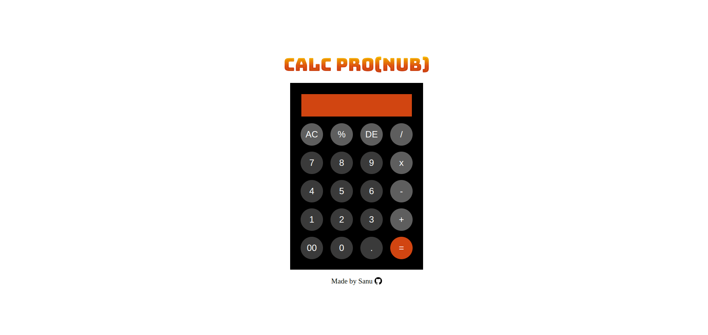

# Calc-Pro

Welcome to Calc Pro! This is a simple calculator web application developed using HTML, CSS, and JavaScript.

## Table of Contents

- [Features](#features)
- [Getting Started](#getting-started)
- [Usage](#usage)
- [Acknowledgments](#acknowledgments)
- [Built With](#built-with)
- [Contributing](#contributing)
- [License](#license)

## Features

- Basic arithmetic operations: addition, subtraction, multiplication, division
- Additional features: Remainder, clear display, delete last character, error handling for division by zero
- Responsive design for various screen sizes
- Modern and stylish user interface

## Getting Started

To view the Calc Pro Website:

1. Clone the repository: `git clone https://github.com/idevRavn/Calc-Pro.git`
2. Open `index.html` in your preferred web browser.

## Usage

To use the calculator, simply click on the buttons to input numbers and operators. The display will show the current input and the result of calculations. The calculator supports the following buttons:

- Digits: 0-9
- Decimal Point: .
- Double Zero: 00
- Operators: Addition (+), Subtraction (-), Multiplication (x), Division (/), Remainder (%)
- AC (Clear all), DE (Delete last character), = (Equals)

## Acknowledgments

- Fonts: [Bungee Spice](https://fonts.google.com/specimen/Bungee+Spice), [Big Shoulders Stencil Display](https://fonts.google.com/specimen/Big+Shoulders+Stencil+Display)
- Github Icon: [Provided by Flaticon](https://www.flaticon.com/)
